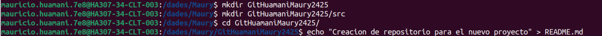
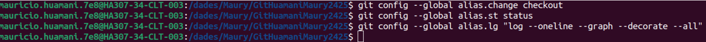
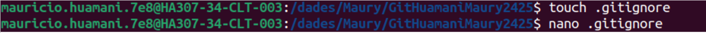
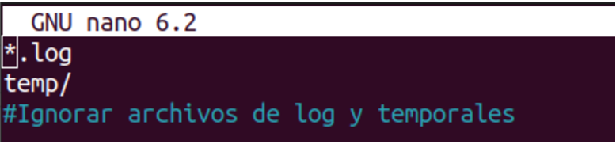
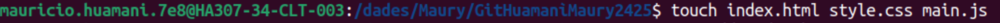
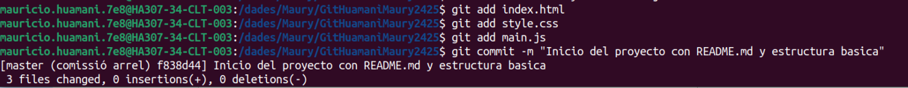
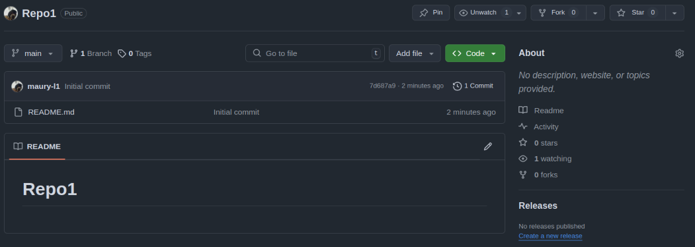
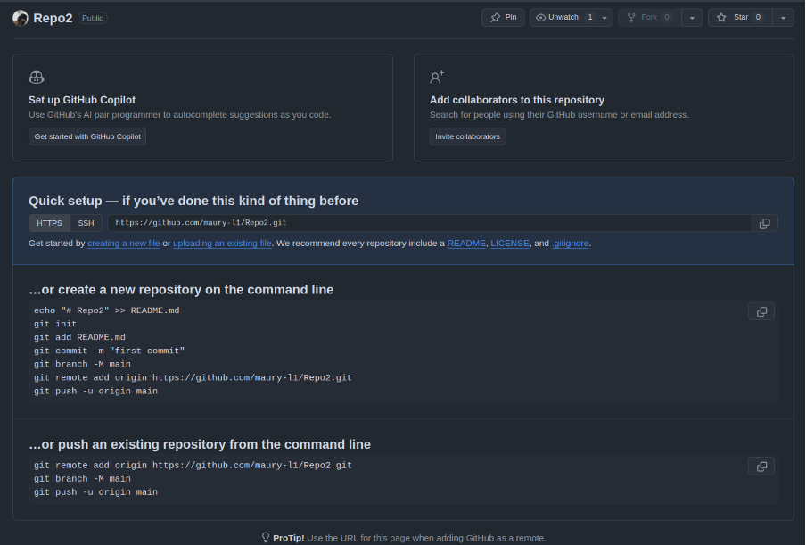
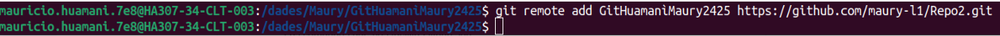

# Practica3-M8

Creamos un directorio nuevo y dentro creamos una subcarpeta llamada “src” y en el directorio principal creamos un archivo README.md

Creamos alias para facilitar el trabajo

Creamos un archivo .gitignore con la siguiente configuración

Este archivo sirve para indicarle a Git que ignore los archivos de esos tipos, es decir que no los restree, en este caso archivos de tipo .log y temporales.

Añadimos los 3 archivos y hacemos commit

Si creamos un repositorio en github con un README.md se crea un commit “Initial commit” con un archivo readme con el nombre del repositorio

Si creamos un repositorio en github sin un archivo README.md, se crea un repositorio vacio y nos dan otras opciones que con la opcion anterior no aparecian

Los comandos que nos facilita Github son: 

echo "# Repo2" >> README.md
git init
git add README.md
git commit -m "first commit"
git branch -M main
git remote add origin https://github.com/maury-l1/Repo2.git
git push -u origin main

Vinculamos el repositorio local con el repositorio remoto con el comando 

git remote add 

Creamos una nueva rama llamada feature/documentation y dentro de esta creamos un archivo docs.md, añadimos este archivo y hacemos un commit
